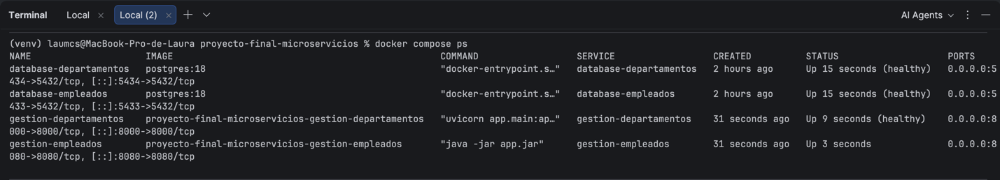

# Proyecto Final - Microservicios

## Descripción

Sistema distribuido basado en una arquitectura de microservicios,
desarrollado de manera incremental a través de los retos del curso.

## Arquitectura

El proyecto estará compuesto por múltiples microservicios
independientes, un API Gateway, un message broker, bases de datos
y herramientas de observabilidad.

## Microservicios

| Microservicio            | Tecnología            | Estado                                                                               |
|--------------------------|-----------------------|--------------------------------------------------------------------------------------|
| Gestión de empleados     | Spring Boot + Java 21 | 🟡 Reto 1 completo — [Ver documentación](microservicios/gestion-empleados/README.md) |
| Gestión de departamentos | Pendiente             | 🔴                                                                                   |
| Autenticación            | Pendiente             | 🔴                                                                                   |
| Gestión de perfiles      | Pendiente             | 🔴                                                                                   |
| Gestión de vacaciones    | Pendiente             | 🔴                                                                                   |
| Notificaciones           | Pendiente             | 🔴                                                                                   |
| API Gateway              | Pendiente             | 🔴                                                                                   |
## Tecnologías

Pendiente de definir durante los retos.

## Ejecución

La información de ejecución se agregará conforme avance el proyecto.

### Verificación de arranque ordenado

El proyecto utiliza `healthcheck` en los servicios de base de datos y en el microservicio de gestión de departamentos. Además, `gestion-empleados` utiliza `depends_on` con la condición `service_healthy`, garantizando que sus dependencias estén disponibles antes de iniciar.

Para levantar el proyecto desde cero se ejecuta:

```bash
docker compose up --build
```

Luego se puede verificar el estado de los contenedores mediante:

```bash
docker compose ps
```

La salida permite comprobar que los servicios que funcionan como dependencias se encuentran en estado `healthy`, especialmente:

- `database-empleados`
- `database-departamentos`
- `gestion-departamentos`

Esto evidencia el arranque ordenado de los servicios y la verificación de disponibilidad mediante los `healthcheck` configurados en Docker Compose.

**Evidencia:** A continuación se incluye una captura de pantalla de la salida de `docker compose ps` mostrando los servicios en estado `healthy`.

