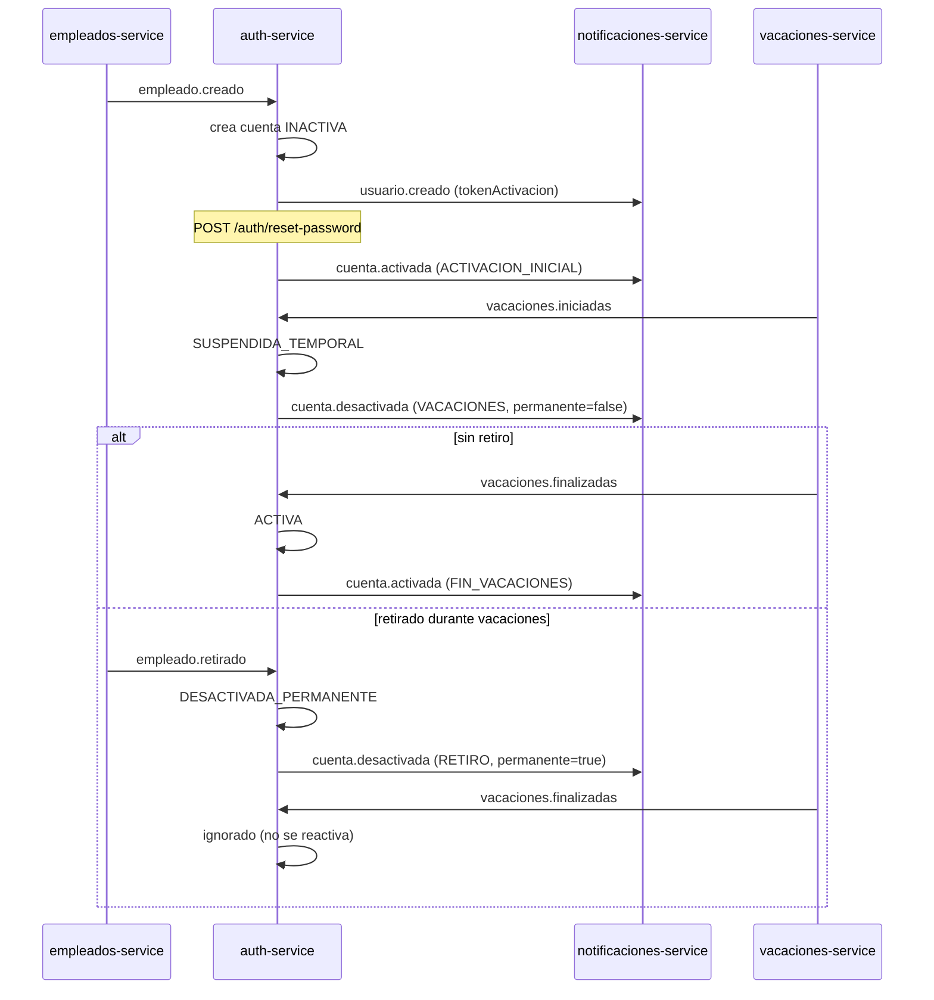

# auth-service

Proveedor de identidad del ecosistema (Reto 5, parte 1). .NET 8 / ASP.NET Core, PostgreSQL (`database-auth`) y RabbitMQ.
Puerto interno **8086** (el 8085 ya lo usa `vacaciones-service`).

Swagger UI: `http://localhost:8086/swagger` (botón **Authorize** → pegar el token sin `Bearer`).

## Endpoints

| Método | Ruta | Auth | Descripción |
|---|---|---|---|
| POST | `/auth/login` | — | `{email, password}` → `{accessToken, tokenType, expiresIn}`. 401 si credenciales inválidas **o cuenta no ACTIVA** |
| POST | `/auth/recover-password` | — | `{email}` → 202 siempre (no revela si el correo existe). Publica `usuario.recuperacion` |
| POST | `/auth/reset-password` | — | `{token, newPassword}`. Sirve para activar (primer uso) y recuperar |
| POST | `/auth/change-password` | JWT | `{currentPassword, newPassword}` |

Política de contraseña: 8–72 caracteres, con mayúscula, minúscula y número.

## Tokens (HS256, clave simétrica `JWT_SECRET`, UTF-8)

**Acceso**: `{ "iss": "auth-service", "sub": "<empleadoId>", "role": "ADMIN|USER", "email": "...", "iat": ..., "exp": ... }`
`sub` es el `empleadoId` (p. ej. `E001`; el admin semilla usa `admin`), para que la regla de propiedad del recurso (`recurso.empleadoId == token.sub`) funcione.

**Reset/activación** (Opción A, stateless): `{ "sub": "<empleadoId>", "type": "RESET_PASSWORD", "pv": "<huella>", "iat", "exp" }`.
Expira en 60 min (activación) o 15 min (recuperación). El claim `pv` es una huella del hash de contraseña vigente: al cambiarla, cualquier token de reset anterior queda inválido (un solo uso sin guardar tokens). Un token de reset no sirve como token de acceso.

## Estados de la cuenta

```
INACTIVA ──(reset-password)──► ACTIVA ◄──(vacaciones.finalizadas)── SUSPENDIDA_TEMPORAL
                                 │                                        ▲
                                 └────────(vacaciones.iniciadas)──────────┘
   cualquier estado ──(empleado.retirado)──► DESACTIVADA_PERMANENTE  (terminal)
```

**Caso borde:** `vacaciones.finalizadas` solo reactiva si el estado es `SUSPENDIDA_TEMPORAL`. Si el empleado fue retirado durante las vacaciones, la cuenta está `DESACTIVADA_PERMANENTE`: se ignora el evento, no se publica `cuenta.activada` y se registra un `WARN` (`NO se reactiva la cuenta`) como evidencia.

## Eventos

Cola `auth.eventos` (exchange `rrhh.events`): consume `empleado.creado`, `empleado.retirado`, `vacaciones.iniciadas`, `vacaciones.finalizadas`.
Publica `usuario.creado`, `usuario.recuperacion`, `cuenta.activada`, `cuenta.desactivada` con el sobre del Catálogo de Eventos (`id`, `type`, `version`, `occurredAt`, `producer`, `data`).
Deduplicación por `id` en la tabla `eventos_procesados`.

## Variables de entorno

| Variable | Descripción | Por defecto |
|---|---|---|
| `JWT_SECRET` | Clave HS256, ≥ 32 caracteres (obligatoria) | — |
| `JWT_ISSUER` | Emisor del token | `auth-service` |
| `ACCESS_TOKEN_MINUTES` | Vida del token de acceso | 60 |
| `ACTIVATION_TOKEN_MINUTES` | Vida del token de activación | 60 |
| `RECOVERY_TOKEN_MINUTES` | Vida del token de recuperación | 15 |
| `ADMIN_EMPLEADO_ID` / `ADMIN_EMAIL` / `ADMIN_PASSWORD` | Admin semilla | `admin` / — / — |
| `DB_*`, `RABBITMQ_*` | Conexiones | ver `docker-compose.yml` |

## Limitaciones conocidas

- **Tokens ya emitidos:** suspender o retirar una cuenta impide nuevos logins, pero un access token vigente sigue siendo válido hasta su `exp` (stateless). Se mitiga con expiración corta; la revocación inmediata exigiría lista de revocación o introspección.
- **Publicación de eventos:** se publica antes del commit (al-menos-una-vez). El Outbox formal llega en el Reto 29.

## Prueba rápida

```bash
# 1. Login del admin semilla
curl -s localhost:8086/auth/login -H 'Content-Type: application/json' \
  -d '{"email":"admin@empresa.com","password":"Admin12345"}'

# 2. Tras crear un empleado, tomar tokenActivacion del log de notificaciones y:
curl -s localhost:8086/auth/reset-password -H 'Content-Type: application/json' \
  -d '{"token":"<tokenActivacion>","newPassword":"Clave12345"}'

# 3. Recuperación
curl -s localhost:8086/auth/recover-password -H 'Content-Type: application/json' \
  -d '{"email":"juan.perez@empresa.com"}'
```

## Ciclo de vida (diagrama de secuencia)


